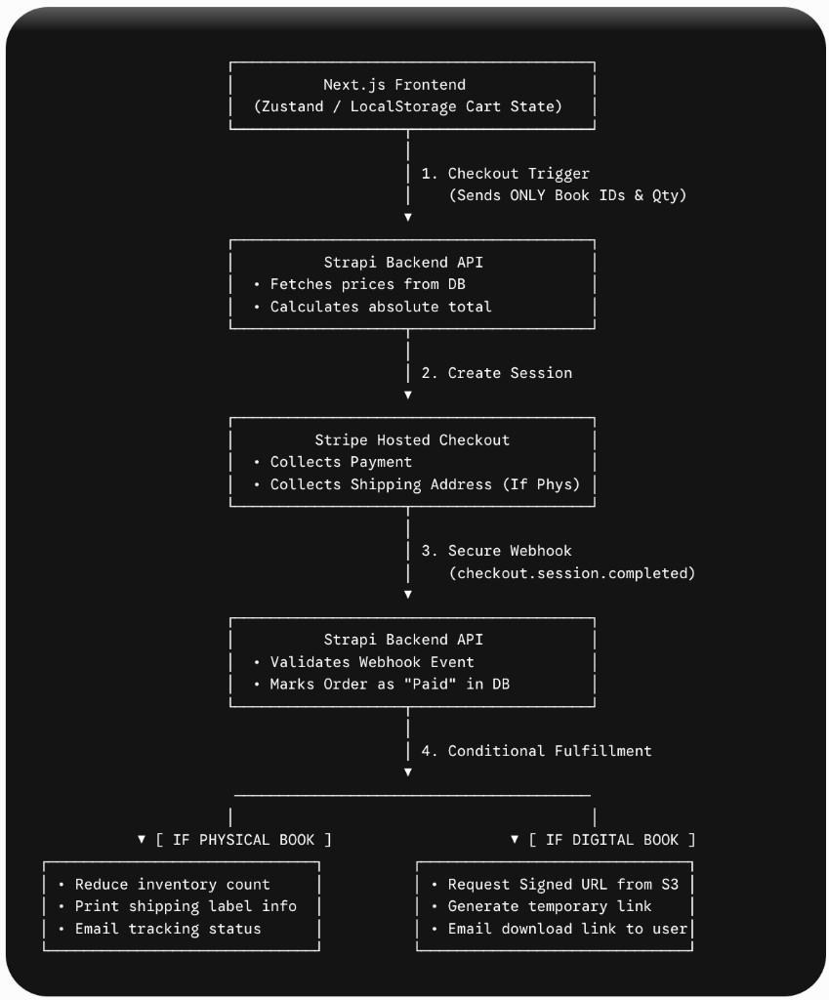
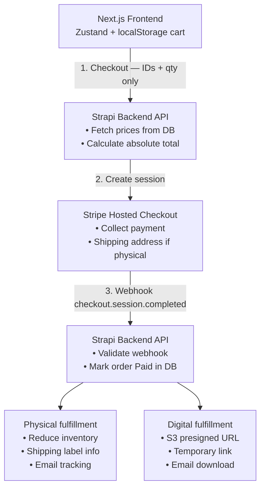

# Novella

**An online bookstore for physical books** — calm, reader-first commerce UI with a **Strapi 5 CMS** for catalog content and **bank-transfer checkout** (Stripe integration planned).

**Author:** Shwe Yee Winn · [yonngelay@gmail.com](mailto:yonngelay@gmail.com)

## Structure

| Path | Purpose |
|------|---------|
| [`apps/storefront`](./apps/storefront) | Next.js 16 shop (React 19, Tailwind v4, Zustand cart/wishlist) |
| [`apps/strapi`](./apps/strapi) | Strapi 5 CMS (books, blog, categories, site settings) |

Storefront details: [`apps/storefront/README.md`](./apps/storefront/README.md) · Performance: [`apps/storefront/PERFORMANCE.md`](./apps/storefront/PERFORMANCE.md)

## What’s built (storefront)

### Brand & layout

- **Cozy Book** palette (parchment, espresso, terracotta, gold) — see [Design](#design-direction)
- **Wordmark** — “Novella” in EB Garamond (header); favicon under `public/` and `src/app/icon.png`
- **Fonts:** EB Garamond (headings), Lora (body) — weights 400 & 600 only
- **Header:** logo · nav · compact search · account menu · cart — search stays on the **top bar on mobile**
- **Active nav** item uses primary terracotta (`Home` on `/`, `Books` on `/shop`, etc.)
- **Scroll-to-top** button; global search via `SearchProvider` (no shop-page flicker)

### Home

- Hero: physical-books positioning + shop CTAs
- **Pre-Orders** carousel (5 titles with cover art)
- **New Arrivals** carousel (8 titles with cover art)
- **Browse by category** — 8 WebP tiles, 4×2 grid, “More categories” CTA
- Additional home shelves (Clearance, Fiction, etc.) are **commented out** in `homeSections.ts` until CMS data exists
- Carousels: **1 book per slide on mobile**; prev/next advances one slide; **View more** solid primary button

### Catalog & shop

- **13 in-stock titles** with jacket images only (demo placeholders without covers removed)
- Catalog: **Strapi REST** when `STRAPI_API_URL` is set; static modules (`preOrderBooks.ts`, `newReleaseBooks.ts`) as fallback
- **`/shop`** — server-rendered listing, **20 books per page**, URL pagination (`?page=2`)
- Top **filter bar** (no sidebar): Category, sort (physical books only — no format filter)
- **Inventory count** in header; filters via `?categories=` (legacy `?category=` still works)
- **4 books per row** on large screens; collection URLs e.g. `/shop?collection=pre-order`

### Books UI

- `BookCard`: cover on top, title/author/rating/price/actions below; aligned title heights; wishlist + add to cart
- `BookCover`: `object-contain`, optional `coverImageSrc`
- Pre-orders always orderable; physical stock from `inventoryCount`

### Other routes

| Route | Description |
|-------|-------------|
| `/` | Home |
| `/shop` | Catalog (server-rendered, filters, pagination) |
| `/shop?collection=pre-order` | Pre-order collection |
| `/search?q=` | Dedicated search results (not on `/shop`) |
| `/categories` | All browse categories |
| `/books/[slug]` | Product detail + related books |
| `/cart` | Cart (Zustand + `localStorage`) |
| `/wishlist` | Saved books |
| `/authors` | Author list → shop search |
| `/blog`, `/blog/[slug]` | Editorial (mock posts) |
| `/about`, `/contact` | Static pages |
| `/login`, `/signup`, `/account` | Auth + order history |
| `/checkout` | Review → `POST /api/checkout` (IDs + qty only) |
| `/checkout/success` | Order received — upload bank payment proof on-site |
| `/checkout/cancel` | Checkout cancelled |
| `/admin/orders` | Admin order queue (payment review → fulfillment) |

## Architecture

Novella splits **content** (Strapi CMS), **commerce UI** (Next.js), and **payments / fulfillment** (Stripe + webhooks). The diagram below is the end-to-end **checkout and fulfillment** flow—the security-critical path where prices are validated on the server and orders are completed even if the buyer closes the browser after paying.



### Flow (numbered steps)

| Step | From → To | What happens |
|------|-----------|----------------|
| **1** | Next.js → Strapi | Checkout trigger sends **only** book IDs and quantities (Zustand cart in `localStorage`). |
| **2** | Strapi → Stripe | Backend loads prices from the DB, computes the total, creates a Stripe Checkout Session. |
| **3** | Stripe → Strapi | After payment, Stripe calls the webhook (`checkout.session.completed`). Strapi verifies the signature and marks the order **Paid**. |
| **4a** | Strapi (physical) | Decrement `inventory_count`, capture shipping from Stripe, send confirmation / tracking email. |
| **4b** | Strapi (digital) | Generate a short-lived S3 presigned URL, email the download link to the buyer. |

**Stripe Checkout** collects payment and, for physical books, the shipping address (`allowed_countries`). **Digital files** stay in a private S3 bucket—never in a public web folder.

### Mermaid (same flow, for GitHub rendering)



### Implementation status

| Piece | Status |
|-------|--------|
| Storefront UI (home, shop, PDP, cart, wishlist, search) | ✅ `apps/storefront` |
| Static catalog + cover images (pre-order, new releases) | ✅ |
| Server shop listing + pagination + filters | ✅ |
| Image WebP pipeline + cache headers | ✅ |
| Server price validation (demo) | ✅ `POST /api/checkout` |
| Strapi CMS + DB prices | ✅ `apps/strapi` (storefront reads catalog via REST) |
| Stripe Checkout + webhook | 🔜 |
| Physical inventory + shipping | 🔜 |
| Digital S3 presigned + email | 🔜 |

## Git & releases

Team workflow (atomic commits, rebase, PR checklist, secrets, environments): **[`docs/GIT_AND_RELEASE.md`](./docs/GIT_AND_RELEASE.md)**.

Storefront code standards: **[`apps/storefront/CODING_STANDARDS.md`](./apps/storefront/CODING_STANDARDS.md)**.

## Development

From the repo root:

```bash
npm install
npm run dev          # storefront → http://localhost:3000
```

### Strapi CMS (optional, recommended)

Strapi is **not** in the npm workspace — install and run it separately:

```bash
cd apps/strapi
cp .env.example .env   # first time
npm install
npm run develop        # API http://localhost:1337/api · admin http://localhost:1337/admin
```

From the repo root you can also use `npm run dev:cms`. On first boot, seed data loads from `database/seed/`. See [`apps/strapi/README.md`](./apps/strapi/README.md).

Storefront env (`apps/storefront/.env.local`):

```env
NEXT_PUBLIC_STRAPI_URL=http://localhost:1337
STRAPI_API_URL=http://localhost:1337
STRAPI_REVALIDATE_SECONDS=60
```

Optional read token: `STRAPI_API_TOKEN` (Strapi admin → Settings → API Tokens).

### Storefront only

```bash
cd apps/storefront
npm run dev
```

### Assets

After adding PNG/JPEG covers or category art:

```bash
cd apps/storefront
npm run optimize:images
```

Updates catalog paths to `.webp` under `public/covers/` and `public/categories/`. See [`PERFORMANCE.md`](./apps/storefront/PERFORMANCE.md).

Production CMS example:

```env
STRAPI_API_URL=https://cms.example.com
NEXT_PUBLIC_STRAPI_URL=https://cms.example.com
NEXT_PUBLIC_STRAPI_IMAGE_HOST=cms.example.com
STRAPI_REVALIDATE_SECONDS=60
```

Config: `apps/storefront/src/config/strapi.ts`.

## Code quality

| Command | What it does |
|---------|----------------|
| `npm run dev:cms` | Strapi develop (`apps/strapi`) |
| `npm run build:cms` | Strapi production build |
| `npm run lint` | ESLint (Next.js + TypeScript) |
| `npm run lint:fix` | ESLint with auto-fix |
| `npm run format` | Prettier write |
| `npm run format:check` | Prettier check only |
| `npm run typecheck` | `tsc --noEmit` |
| `npm run check` | typecheck + lint + format check |
| `npm run build` | Production build (storefront) |

Storefront-only:

| Command | What it does |
|---------|----------------|
| `npm run optimize:images` | Compress `public/covers`, categories, logo → WebP |
| `npm run perf:lighthouse` | Lighthouse on localhost (dev server must be running) |

CI runs `npm run check` and `npm run build` on push/PR to `main` (see `.github/workflows/ci.yml`).

## Design direction

Novella intentionally avoids loud marketplace UI (heavy chrome, dense grids, cluttered badges). The reference is **international reader-first** shops and publishers:

- **Light only** — no dark mode
- **Parchment white** `#F9F6F0` — page background (`--paper`)
- **Dark espresso** `#3D2C1F` — text (`--ink`)
- **Warm terracotta** `#C87A53` — buttons, links, active nav (hover `#A86640`)
- **Warm oatmeal** `#E6DFD3` — muted surfaces (`--paper-muted`)
- **Soft antique gold** `#D4AF37` — star ratings (≤10% accent use)
- **Border** `#D9D0C4`

**60-30-10:** ~60% parchment, ~30% espresso + oatmeal, ≤10% terracotta + gold.

- **Typography** — EB Garamond (`font-serif`) for headings; Lora (`font-sans`) for UI and body
- **Whitespace** — generous padding; light borders
- **Cart UX** — header count + short “added to cart” on cards; full cart at `/cart` (no slide-out drawer)

Blog, shop catalog, categories, and site copy are served from **Strapi** when configured; the storefront keeps static fallbacks for local work without the CMS.

Checkout sends `POST /api/checkout` with `{ items: [{ id, quantity }] }` only — prices are computed on the server from the catalog (Strapi when available).
